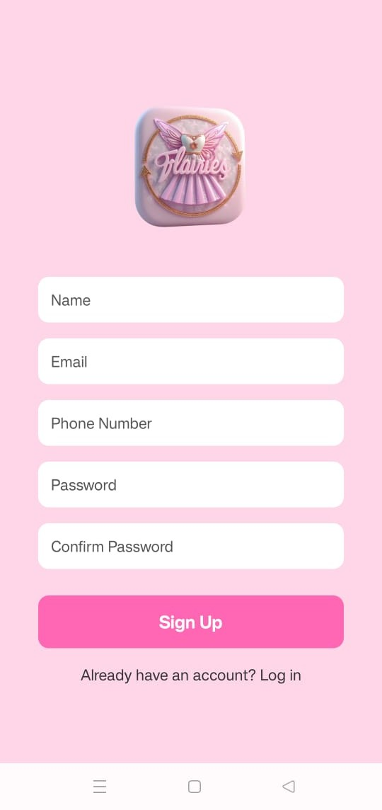
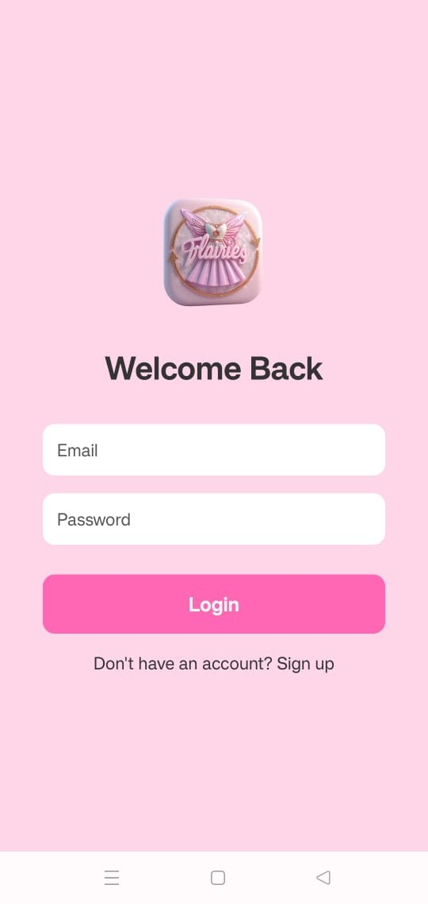
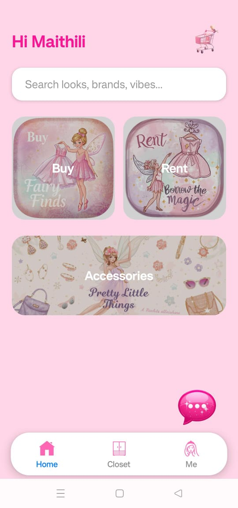
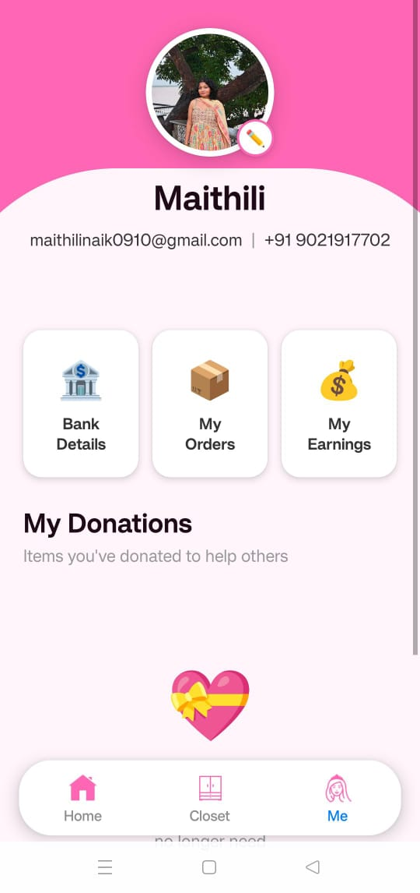
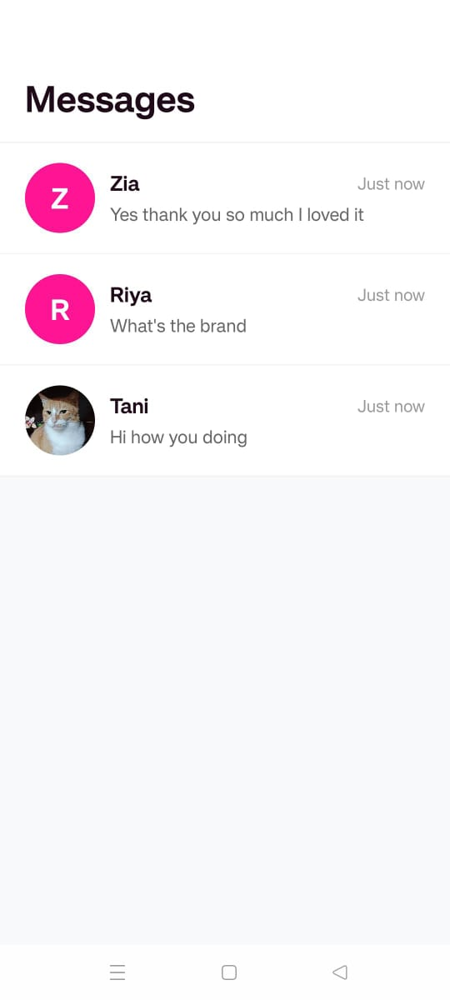
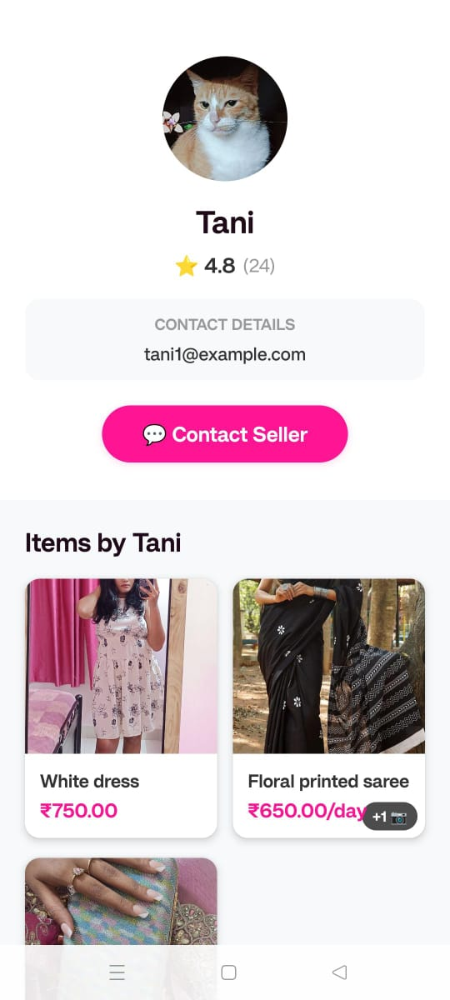
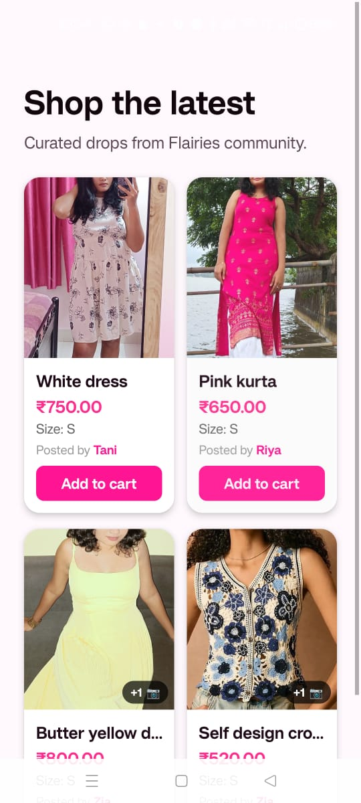
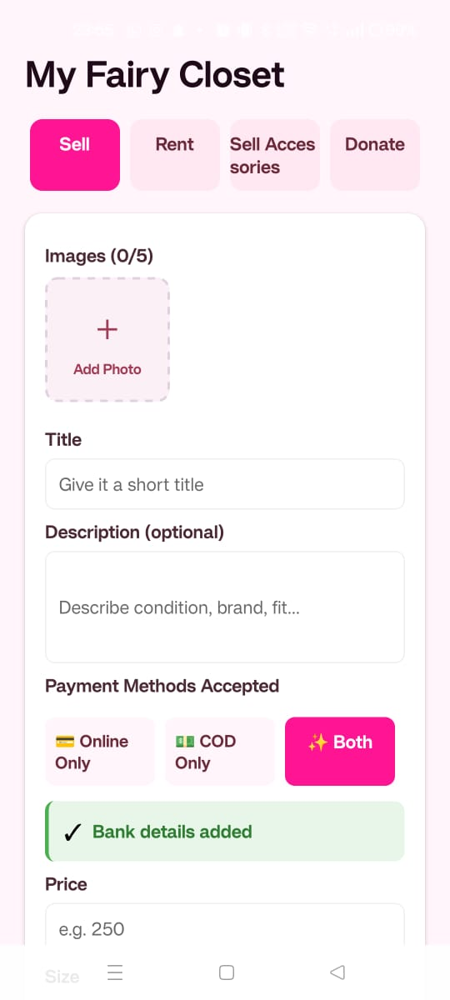
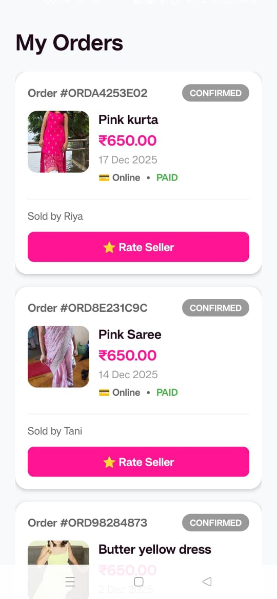
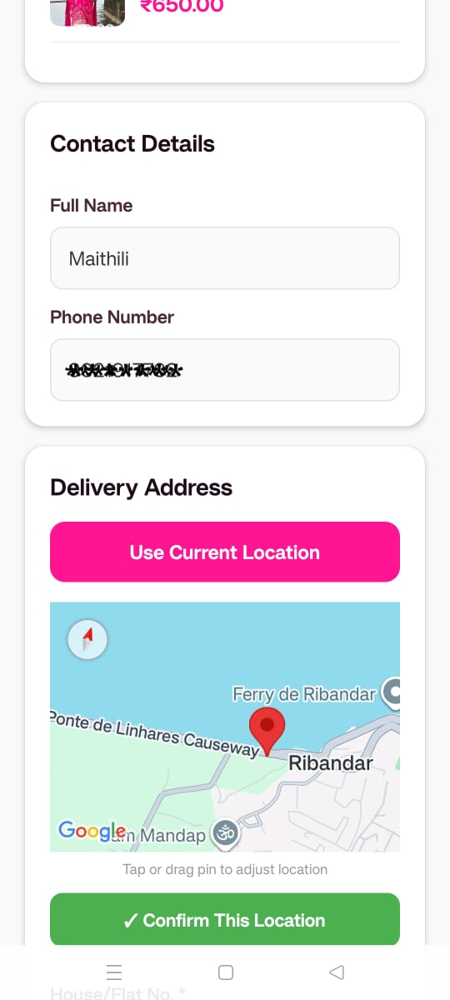

# Flairies

**Flairies** is a mobile-first app designed for all the girls oit there to sell, rent or donate clothes and accessories. It emphasizes community, sustainability and girlhood empowerment, enabling users to share their wardrobe, discover fashion items and connect safely.

## Features

**User Profiles:** Secure sign-up/login, profile management, seller details, and address storage with location sync.  
**Listings:** Post thrift fashion items including clothes, shoes, bags, and accessories with images, pricing, size, and descriptions.  
**Transactions:** Buy, sell, rent, or donate items with order tracking and item availability management.  
**Payments:** Integrated Razorpay for secure online payments with order confirmation and status updates.  
**Location Services:** Google Maps–based location picker for address selection, reverse geocoding, and delivery coordination.  
**Real-Time Chat:** In-app messaging between buyers and sellers with conversation management.  
**Search & Filter:** Browse and filter listings by category, size, price, and availability.  
**Notifications:** In-app and push notifications for purchases, messages, and order updates.  
**Admin Panel:** Platform moderation, user and listing management, and transaction monitoring.  

## Tech Stack

**-Frontend:** React Native with Expo, Redux Toolkit, React Navigation 
**-Backend:** Django REST Framework / Supabase for authentication & database  
**-Database:** Supabase PostgreSQL

## Demo Screenshots  

### Signup & Login

  
  

### Home & Profile

  
  

### Chat & Seller Profile

  
  

### Buy & Sell

  
  

### My Orders & Google Maps

  
  

